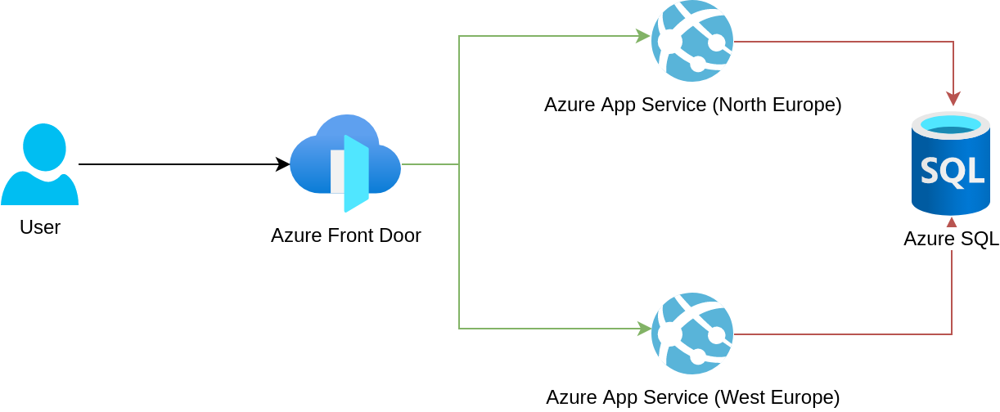
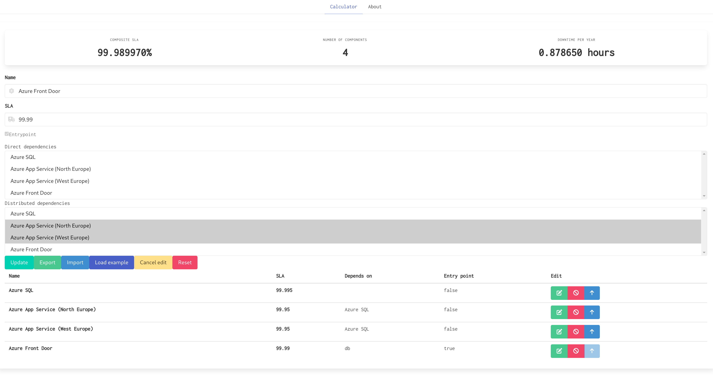

# SlaCalculator

Calculate composite SLA for solutions.

# Web version

Let's insert the following reference architecture into the web UI of **SlaCalculator**:



It will look like this:



* Entrypoint is set to **Azure Front Door** as the users will connect to that endpoint and the composite SLA will be calculated from that service
* **Azure Front Door** has a **distributed** dependency on two **App Services**; a distributed dependency means that the two service are redundant and if one fails, the other will continue to work, this increases the SLA of a single **App Service**
* Both the **App Services** have a **direct** dependency on a **SQL database**, this means that the composite SLA will decrease as it will need to take into account outages potentially happening to both an **App Service** and a **SQL database** sequentially, summing up their downtime

Play with the arrow button on each service to understand what the SLA would look like if that service was the entrypoint of the system.

The overall SLA of the solution is higher than the **App Service** as they are redundant, but it's lower than **Azure Front Door** and **Azure SQL** as they are in sequence without redundancy. 

# Script version

Add the components following the example to `main.fsx` and run the script to get the results.

# Example
```fsharp
let sqlDatabase = {
    SLA = 99.95m
    Dependencies = []
}

let appService = {
    SLA = 99.95m
    Dependencies = [ Direct sqlDatabase ]
}
    
calculateCompositeSla appService
|> printfn "%A"
    
let queue = {
    SLA = 99.9m
    Dependencies = []
}

let sqlDatabase' = {
    SLA = 99.99m
    Dependencies = []
}

let webApp = {
    SLA = 99.95m
    Dependencies = [ Distributed [ sqlDatabase'; queue ] ]
}

calculateCompositeSla webApp
|> printfn "%A"

let trafficManager = {
    SLA = 99.99m
    Dependencies = [ Distributed [ appService; webApp ] ]
}

calculateCompositeSla trafficManager
|> printfn "%A"
```
```
99.90M
99.9499900M
99.9899499900M
```
